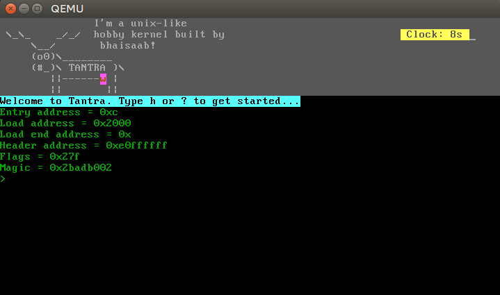

# Tantra

<pre>
 \_\_    _/_/
     \__/
     (o0)\________
     (#_)\ tantra )\
        ||------w |
        ||       ||
</pre>

Tantra is hobby unix-like kernel. The __sanskrit__ word `tantra` (तंत्र) means system.

## Building

Available build profiles:

    make all
    make iso
    make run
    make run-qemu

### Debugging

Use bochs to step into instructions and see registers in action:

    make run

    > In bochs:
    > lb 0x0010000c  # This is our kernel's loader address
    > c
    > r  # Bochs should break at the above breakpoint, prints registers
         # You should find 0xBADA55 in the rax/eax register :)
